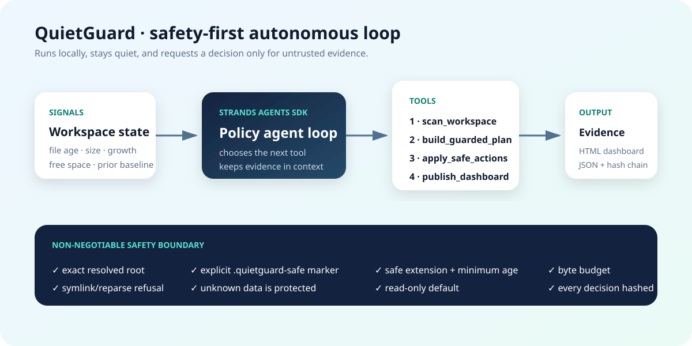
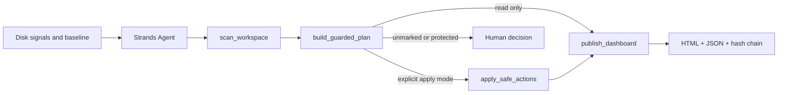

# QuietGuard

QuietGuard is a Strands-powered agent that catches disk-pressure incidents such as runaway diagnostic logs, makes a bounded plan, and stays silent until there is a real decision. It defaults to read-only operation. Automatic cleanup is available only below directories that contain an explicit `.quietguard-safe` marker, and every decision is recorded in a hash-chained audit log.



## Why this matters

Log storms often look harmless until a workstation or small-business machine runs out of disk space. Repeated manual cleanup wastes time, while broad cleanup scripts can delete user data. QuietGuard separates evidence collection, classification, guarded action, and escalation. It handles known regenerable files and surfaces unmarked or stateful files for review.

## What the agent does

The real `strands.Agent` loop uses four decorated Strands tools:

1. `scan_workspace` walks the configured root without following symlinks or Windows reparse points, compares a saved baseline, and classifies evidence.
2. `build_guarded_plan` selects only old files with safe extensions below an explicit marker and fits them inside a cycle byte budget.
3. `apply_safe_actions` re-checks the boundary, marker, reparse status, extension, and existence immediately before each action.
4. `publish_dashboard` writes the incident JSON, a standalone visual dashboard, and a tamper-evident audit chain.

The bundled offline policy model implements Strands' custom `Model` interface, so the demo needs no account, API key, cloud service, or paid inference. A production deployment can swap in Bedrock, OpenAI, Ollama, or another Strands provider without changing the safety tools.



## Run the contained demo

Python 3.10 or newer is required.

```powershell
python -m venv .venv
.\.venv\Scripts\python.exe -m pip install -e .
.\.venv\Scripts\quietguard.exe demo
```

The demo creates a new synthetic workspace under `artifacts/`, detects a simulated Excel-diagnostics log storm, removes only two marker-allowlisted old files, preserves a SQLite database and an unmarked log, and publishes `dashboard.html`, `incident-report.json`, and `audit.jsonl`.

Run against any directory in read-only mode:

```powershell
.\.venv\Scripts\quietguard.exe run C:\path\to\inspect --output .\artifacts\read-only
```

Guarded action mode must be requested explicitly:

```powershell
.\.venv\Scripts\quietguard.exe run C:\path\to\inspect --output .\artifacts\apply --apply
```

Adding `.quietguard-safe` is a deliberate operator decision. It only enables old `.log`, `.tmp`, `.trace`, and `.dmp` files below that directory. Unknown file types, databases, documents, media, archives, unmarked logs, symlinks, reparse points, and paths outside the exact root remain protected.

Serve a completed dashboard locally:

```powershell
.\.venv\Scripts\quietguard.exe serve .\artifacts\demo-YYYYMMDD-HHMMSS\evidence
```

## Verify

```powershell
.\.venv\Scripts\python.exe -m pytest
```

The tests prove classification, marker enforcement, outside-root refusal, action budgets, symlink/reparse avoidance where supported, audit-chain integrity, and actual Strands tool ordering.

## Hackathon disclosure

This project was created during the Agents for Humans Hackathon submission period. OpenAI Codex was used as a coding assistant. The product design, safety rules, source code, tests, and demo artifacts in this repository are new work for the hackathon. QuietGuard uses the Strands Agents SDK 1.54.0 and is released under the MIT License.


